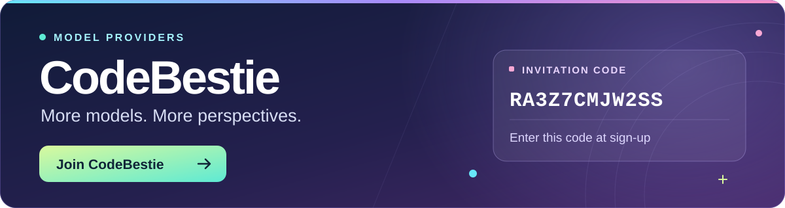

<div align="center">

<p><strong>English</strong> · <a href="README.zh.md">简体中文</a></p>
<h1>DSH Council</h1>
<p><strong>Independent answers. Anonymous reviews. One reasoned decision.</strong></p>
<p>Multi-model deliberation inside <a href="https://github.com/deepseek-ai/deepseek-harness">DeepSeek Harness</a>.</p>

<p>


</p>

<p><a href="#installation">Installation</a> · <a href="#how-it-works">How it works</a> · <a href="#configuration">Configuration</a> · <a href="#contributing">Contributing</a></p>

https://github.com/user-attachments/assets/e81dfa36-5d93-4efb-8c67-015a5e4d2179


</div>

---

## How it works

<table>
<tr>
<td width="33%" valign="top">
<h3>01 · Answer</h3>
<p>2–8 models respond independently in parallel.</p>
</td>
<td width="33%" valign="top">
<h3>02 · Review</h3>
<p>1–8 reviewers compare anonymous answers, identify gaps, and rank them.</p>
</td>
<td width="33%" valign="top">
<h3>03 · Decide</h3>
<p>One arbiter weighs the answers and reviews to produce a final recommendation.</p>
</td>
</tr>
<tr>
<td colspan="3">
<p><strong>Your models.</strong> Use configured DSH providers and credentials. Choose models separately for each role, with reuse across roles. English and Chinese follow DSH's language setting.</p>
<p><strong>Inspectable results.</strong> Confidence notes, consensus, disagreements, blind spots, model identities, and average rankings. Original answers and reviews remain in DSH's child sessions.</p>
</td>
</tr>
</table>

## Installation

### 1. Install DSH

Install [DeepSeek Harness (dsh)](https://www.deepseek.com/harness/) by following the official installation guide.

### 2. Install DSH Council

<table>
<tr>
<th>Node.js</th>
<th>pnpm</th>
<th>DeepSeek Harness</th>
</tr>
<tr>
<td><code>^22.19.0 || >=24.0.0</code></td>
<td><code>11.7.0</code></td>
<td>At least two configured, authenticated models</td>
</tr>
</table>

Install the prebuilt package from npm:

```sh
npx --yes @deepseek-ai/dsh@latest plugin --profile web add @a1exsun/dsh-council@0.1.0
npx --yes @deepseek-ai/dsh@latest web
```

<blockquote><p>Restart DSH Web if it is already running.</p></blockquote>

No source checkout or compilation is required. See [Contributing](CONTRIBUTING.md) for development setup.

## Usage

Enter this command in a DSH Web conversation:

```text
/council
```

<table>
<tr>
<td width="35%" valign="top">
<h3>Choose your panel</h3>
<p>Select answerers, reviewers, and an arbiter. Selections apply to one run.</p>
</td>
<td width="65%" valign="top">
<h3>Ask your question</h3>
<p>Each participant starts with fresh context. Include the information it needs in your question.</p>
</td>
</tr>
</table>

<details open>
<summary><strong>Example question</strong></summary>

> Compare PostgreSQL leasing with a managed message queue for three workers. Explain how each recovers when a worker crashes after an external side effect but before acknowledging the job. Recommend one design and state its assumptions.

</details>

<table>
<tr>
<td width="33%" valign="top">
<p><strong>Cost</strong></p>
<p>4–17 model participants per run. Each may make multiple requests and use Web tools.</p>
</td>
<td width="33%" valign="top">
<p><strong>Privacy</strong></p>
<p>Your question and intermediate answers go to selected providers. See <a href="SECURITY.md">Security</a>.</p>
</td>
<td width="33%" valign="top">
<p><strong>Accuracy</strong></p>
<p>Model agreement does not guarantee correctness. Review the evidence and confidence notes.</p>
</td>
</tr>
</table>

## Need more AI models?

<a href="https://app.codebestie.org/register?aff=RA3Z7CMJW2SS">

</a>

## Configuration

<details>
<summary><strong>Defaults and overrides</strong></summary>

The defaults work without additional configuration. To adjust limits, set `config` on the `dsh-council` entry in your DSH profile:

```yaml
- id: dsh-council
  config:
    answerMaxTokens: 16384
    reviewMaxTokens: 16384
    arbiterMaxTokens: 16384
    childTimeoutMs: 300000
    runTimeoutMs: 900000
    subagentProvider: spawn
```

Token limits apply per model request. Timeouts are in milliseconds; `runTimeoutMs` must be at least `childTimeoutMs`.

</details>

## Contributing

<p align="center"><a href="CONTRIBUTING.md"><strong>Development setup · Tests · Bug reports →</strong></a></p>

## Acknowledgements

<blockquote>
<p>Thanks to Andrej Karpathy for <a href="https://github.com/karpathy/llm-council"><strong>llm-council</strong></a>, which inspired this project.</p>
</blockquote>

<p><sub>Review dimensions also draw on <a href="https://openrouter.ai/docs/guides/features/plugins/fusion">OpenRouter Fusion</a>.</sub></p>
