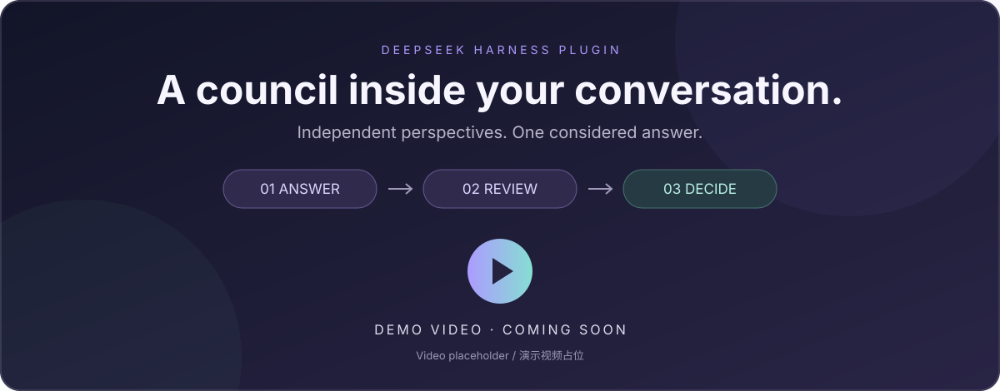

<div align="center">

<p><a href="README.md">English</a> · <strong>简体中文</strong></p>
<h1>DSH Council</h1>
<p><strong>独立作答，匿名互评，汇总裁决。</strong></p>
<p>运行在 <a href="https://github.com/deepseek-ai/deepseek-harness">DeepSeek Harness</a> 对话中的多模型议会插件。</p>

<p>


</p>

<p><a href="#快速开始">快速开始</a> · <a href="#议会如何工作">工作流程</a> · <a href="#配置">配置</a> · <a href="#开发与测试">开发与测试</a></p>

<!-- DEMO VIDEO：将占位图替换为上传到 GitHub 的视频链接，保留在 README 顶部。 -->

<p><sub>演示视频待上传 · 当前占位图不可播放。</sub></p>

</div>

---

在现有 DSH Web 对话中输入 `/council`，选择回答人、评审人和裁决人。插件收集独立回答，匿名比较不同观点，最后给出综合答案与可检查的审计摘要。

插件复用 DSH 已配置的 provider 和凭据，无需维护第二份模型列表，也不要求 OpenRouter 账户。

<table>
<tr>
<td width="33%"><strong>01 · 回答</strong><br>2–8 个模型并行、独立作答。</td>
<td width="33%"><strong>02 · 评审</strong><br>1–8 个评审人比较匿名回答并排名。</td>
<td width="33%"><strong>03 · 裁决</strong><br>一个裁决人综合证据、解决分歧。</td>
</tr>
</table>

## 核心能力

| 能力 | 实际行为 |
| :--- | :--- |
| **实时模型发现** | 每次调用读取所有已配置 provider 的模型目录。 |
| **独立选择角色** | 分别指定回答人、评审人和裁决人，允许跨角色复用模型。 |
| **匿名比较** | 随机分配回答标签；评审和裁决输入不携带路由元数据。 |
| **结构化评审** | 优缺点、共识、矛盾、覆盖缺口、独特洞见、盲点和完整排名。 |
| **Web 证据** | 宿主提供时，子代理可使用 `web_search` 与 `web_fetch`。 |
| **可检查的输出** | 最终答案、身份映射、平均排名、置信说明和失败记录。 |
| **双语交互** | 英文与简体中文跟随 DSH 语言设置。 |

适合有竞争解释、大量证据或多种设计取舍的问题。多个模型一致并不等于独立验证，也不能保证答案正确。

## 快速开始

### 1. 准备源码

克隆或下载本仓库，然后执行：

```sh
cd dsh-council
pnpm install --frozen-lockfile
pnpm check
```

要求 **Node.js `^22.19.0 || >=24.0.0`**、**pnpm 11.7.0** 和 DSH。本次发布验证的最新宿主为 **DSH `0.1.2-rc.1`**。DSH 处于开发预览阶段，API 持续演进；宿主测试每次都会解析 npm `latest`。

### 2. 安装到 DSH

在已构建的仓库目录中执行：

```sh
npx --yes @deepseek-ai/dsh@latest plugin --profile web add .
npx --yes @deepseek-ai/dsh@latest --profile web --dump-config
npx --yes @deepseek-ai/dsh@latest web
```

安装或重新构建后，需重启已运行的 Web 进程。配置输出应包含 `dsh-council` 条目。

在 DSH 中配置并认证至少两个模型路由。目录发现读取宿主公布的路由，**不会**付费调用模型进行探测，也不能保证列出的模型一定可调用。

### 3. 启动议会

输入命令，不附加参数：

```text
/council
```

1. **回答人**：选择 2–8 个模型。
2. **评审人**：选择 1–8 个模型。
3. **裁决人**：选择一个模型。
4. **议题**：输入本轮问题。

示例：

> 为三个工作进程设计可从崩溃中恢复的任务队列。明确交付语义、租约过期、幂等性，以及提交外部副作用后、确认任务前发生崩溃的恢复行为。比较两种设计并指出各自依赖的假设。

选择仅用于本轮。再次调用 `/council` 会刷新目录并重新选择阵容。

## 议会如何工作

**回答 → 评审 → 裁决。** 每个阶段等待上一阶段结束。参与者都是全新的 DSH `spawn` 子代理，不复制主对话历史；请在议题中提供必要上下文。

成功回答随机打乱后获得 `回答 A`、`回答 B` 等标签。评审人接收议题和这些回答；裁决人接收匿名回答、结构化评审，以及各回答的平均名次。平均名次越小越好，同分按标签顺序展示。裁决人根据证据作出决定，并非机械选取第一名。

<details>
<summary><strong>结果包含哪些内容？</strong></summary>

- 最终答案与置信说明。
- 回答人、评审人和裁决人的身份映射。
- 平均名次与票数。
- 共识、分歧与盲点。
- provider 目录故障和参与者失败记录。

原始回答和评审保留在 DSH 原生子代理会话中。从空白“新会话”启动时，插件通过不调用模型的空回合保留结果并设置本地化标题；如果用户在议会运行期间开始了普通对话，插件保留该会话的现有状态。

</details>

<details>
<summary><strong>与 Fusion、LLM Council 有何关系？</strong></summary>

比较维度参考 [OpenRouter Fusion](https://openrouter.ai/docs/guides/features/plugins/fusion)，匿名互评和排名参考 [Karpathy 的 LLM Council](https://github.com/karpathy/llm-council)。本项目自行实现 DSH 编排，通过宿主已配置的路由调用模型，不调用 Fusion 接口。

</details>

## 语言

Council 跟随 DSH 实时的 `locale.preference`：`zh` 和 `zh-*` 使用简体中文，其他设置使用英文。覆盖命令列表、角色选择、校验提示、标签、persona、提示词、审计结果和新会话标题。

切换语言会立即更新命令描述，已经运行的议会保持启动时的语言。Provider 名称与上游错误文本原样保留；模型输出语言由提示词约束，并非由翻译引擎强制保证。

## 配置

设置 DSH profile 中 `dsh-council` 条目的 `config`。DSH patch 文件示例：

```yaml
- id: dsh-council
  config:
    answerMaxTokens: 16384
    reviewMaxTokens: 16384
    arbiterMaxTokens: 16384
    childTimeoutMs: 300000
    runTimeoutMs: 900000
    subagentProvider: spawn
```

| 配置项 | 默认值 | 含义 |
| :--- | ---: | :--- |
| `answerMaxTokens` | `16384` | 回答人每次模型请求的输出 token 上限。 |
| `reviewMaxTokens` | `16384` | 评审人每次模型请求的输出 token 上限。 |
| `arbiterMaxTokens` | `16384` | 裁决人每次模型请求的输出 token 上限。 |
| `childTimeoutMs` | `300000` | 每个子代理及每个 provider 目录读取的时间上限。 |
| `runTimeoutMs` | `900000` | 角色选择完成后开始计算的整体时间上限。 |
| `subagentProvider` | `spawn` | DSH 子代理执行 provider。 |

数值须为正整数；超时不超过 `2147483647` 毫秒，且 `runTimeoutMs` 不得小于 `childTimeoutMs`。子代理 provider 必须使用全新上下文，并支持模型选择、persona、工具过滤和结构化输出。用户填写选择器的时间不计入运行预算。

## 可靠性与边界

| 情况 | 行为 |
| :--- | :--- |
| 目录读取失败或超时 | 其他目录仍可选择，失败写入审计。 |
| 部分参与者失败 | 至少一份非空回答和一份有效评审存活时继续。 |
| 回答人或评审人全部失败 | 在下一阶段前停止，报告失败审计。 |
| 裁决失败或无效 | 本轮失败，不伪造最终答案。 |
| 取消、超时或卸载 | 中止活动任务并释放已创建的子代理句柄。 |
| 同一会话重复启动 | 当前操作结束前拒绝；不同会话可以独立运行。 |

**成本。** 每轮创建 `回答人数 + 评审人数 + 1` 个子代理，最少 4 个，最多 17 个。Web 工具与结构化输出重试可能让每个子代理进行多次模型请求。Token 上限是单次请求限制，并非整轮费用上限。

**工具。** 白名单包含 `web_search` 与 `web_fetch`；DSH 另为评审人和裁决人提供 `structured_output`。本地子代理使用原生工具模式，执行守卫也会阻止子代理自身注册的委派工具。每个子代理最多四次 Web 调用是提示词建议。DSH 目录读取接口不接受取消信号，超时会停止等待，但适配器底层读取可能稍后结束。

**数据。** 议题和中间证据会发送给所选 provider，并按 DSH 常规机制存储。评议输入移除了路由元数据，但模型仍可能在正文中自报身份；匿名机制用于减少身份偏好，并非隐私保证。详见 [SECURITY.md](SECURITY.md)。

## 开发与测试

```sh
pnpm check           # 类型检查、确定性测试、生产构建
pnpm test:coverage   # 覆盖率报告及门槛检查
pnpm test:host       # 打包 → 安装最新 DSH → 完整中英文宿主运行
pnpm pack            # 生成可分发的 tarball
```

宿主测试使用临时 DSH home、全新 npm 安装、真实命令注册表和 spawn 子代理，并以确定性模型响应完成测试。安装需要联网，执行无需模型凭据或付费补全。它验证运行时集成，不评估真实模型的回答质量。

```text
src/
├── index.ts       DSH 集成、目录发现、生命周期、会话保留
├── council.ts     角色选择和三阶段编排
├── protocol.ts    校验、匿名载荷、排名、结果渲染
├── locales.ts     中英文文案与模型提示词
├── async.ts       取消与可释放的执行时限
└── types.ts       共享数据契约
```

贡献说明：[CONTRIBUTING.md](CONTRIBUTING.md)。审查与发布检查：[发布准备记录](docs/release-readiness.md)。

## 项目状态

当前版本 `0.1.0`，准备首次公开发布。安装说明以源码为准，不假设 npm 包或在线演示已经发布。正式发布前还需确认开源许可证和最终 GitHub 仓库地址。

<div align="center">
<sub>为 DeepSeek Harness 构建 · 受多模型评议启发</sub><br>
<a href="#dsh-council">回到顶部 ↑</a>
</div>
