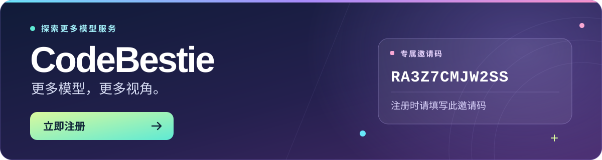

<div align="center">

<p><a href="README.md">English</a> · <strong>简体中文</strong></p>
<h1>DSH Council</h1>
<p><strong>独立作答，匿名互评，汇总裁决。</strong></p>
<p>运行在 <a href="https://github.com/deepseek-ai/deepseek-harness">DeepSeek Harness</a> 对话中的多模型议会插件。</p>

<p>


</p>

<p><a href="#安装">安装</a> · <a href="#工作流程">工作流程</a> · <a href="#配置">配置</a> · <a href="#参与贡献">参与贡献</a></p>

https://github.com/user-attachments/assets/e81dfa36-5d93-4efb-8c67-015a5e4d2179


</div>

---

## 工作流程

<table>
<tr>
<td width="33%" valign="top">
<h3>01 · 回答</h3>
<p>2–8 个模型并行、独立作答。</p>
</td>
<td width="33%" valign="top">
<h3>02 · 评审</h3>
<p>1–8 个评审人比较匿名回答、指出遗漏并排名。</p>
</td>
<td width="33%" valign="top">
<h3>03 · 裁决</h3>
<p>一个裁决人综合回答与评审，给出最终建议。</p>
</td>
</tr>
<tr>
<td colspan="3">
<p><strong>使用已有模型。</strong>复用 DSH 已配置的模型和凭据，各角色独立选择，同一模型可参与多个角色。中英文交互跟随 DSH 的语言设置。</p>
<p><strong>检查完整结果。</strong>查看置信说明、共识、分歧、盲点、模型身份和平均排名。原始回答与评审保留在 DSH 子会话中。</p>
</td>
</tr>
</table>

## 安装

### 1. 安装 DSH

前往 [DeepSeek Harness（dsh）官网](https://www.deepseek.com/harness/)，按照官方指南完成安装。

### 2. 安装 DSH Council

<table>
<tr>
<th>Node.js</th>
<th>pnpm</th>
<th>DeepSeek Harness</th>
</tr>
<tr>
<td><code>^22.19.0 || >=24.0.0</code></td>
<td><code>11.7.0</code></td>
<td>已配置并认证至少两个模型</td>
</tr>
</table>

<details open>
<summary><strong>从源码安装</strong></summary>

```sh
git clone https://github.com/a1exsun/dsh-council.git
cd dsh-council
pnpm install --frozen-lockfile
pnpm build
npx --yes @deepseek-ai/dsh@latest plugin --profile web add .
npx --yes @deepseek-ai/dsh@latest web
```

<blockquote><p>如果 DSH Web 已在运行，请重启。</p></blockquote>

</details>

## 需要更多模型 provider？

<a href="https://app.codebestie.org/register?aff=RA3Z7CMJW2SS">

</a>
<p align="center">注册时请填写邀请码：<strong><code>RA3Z7CMJW2SS</code></strong></p>

## 使用

在 DSH Web 对话中输入：

```text
/council
```

<table>
<tr>
<td width="35%" valign="top">
<h3>选择模型阵容</h3>
<p>选择回答人、评审人和裁决人。模型选择仅用于本轮。</p>
</td>
<td width="65%" valign="top">
<h3>输入议题</h3>
<p>参与者使用全新上下文，请在议题中提供所需信息。</p>
</td>
</tr>
</table>

<details open>
<summary><strong>议题示例</strong></summary>

> 为三个工作进程比较 PostgreSQL 租约与托管消息队列。说明工作进程在产生外部副作用后、确认任务前崩溃时，两种方案各自如何恢复。推荐一种设计并说明假设。

</details>

<table>
<tr>
<td width="33%" valign="top">
<p><strong>费用</strong></p>
<p>每轮有 4–17 个模型参与者，每个参与者可能进行多次请求并使用 Web 工具。</p>
</td>
<td width="33%" valign="top">
<p><strong>隐私</strong></p>
<p>议题和中间回答会发送给所选模型服务。详见<a href="SECURITY.md">安全说明</a>。</p>
</td>
<td width="33%" valign="top">
<p><strong>准确性</strong></p>
<p>多个模型一致不能保证结论正确，请检查证据与置信说明。</p>
</td>
</tr>
</table>

## 配置

<details>
<summary><strong>默认配置与自定义限额</strong></summary>

默认配置可直接使用。如需调整限额，在 DSH profile 的 `dsh-council` 条目中设置 `config`：

```yaml
- id: dsh-council
  config:
    answerMaxTokens: 16384
    reviewMaxTokens: 16384
    arbiterMaxTokens: 16384
    childTimeoutMs: 300000
    runTimeoutMs: 900000
    subagentProvider: spawn
```

Token 限额作用于单次模型请求。超时单位为毫秒，`runTimeoutMs` 不得小于 `childTimeoutMs`。

</details>

## 参与贡献

<p align="center"><a href="CONTRIBUTING.md"><strong>开发环境 · 测试 · 问题反馈 →</strong></a></p>

## 引用与鸣谢

<blockquote>
<p>本项目的想法来自 <a href="https://github.com/karpathy/llm-council"><strong>Andrej Karpathy 的 llm-council</strong></a>。感谢原作者的公开分享。</p>
</blockquote>

<p><sub>评审维度同时参考了 <a href="https://openrouter.ai/docs/guides/features/plugins/fusion">OpenRouter Fusion</a>。</sub></p>
